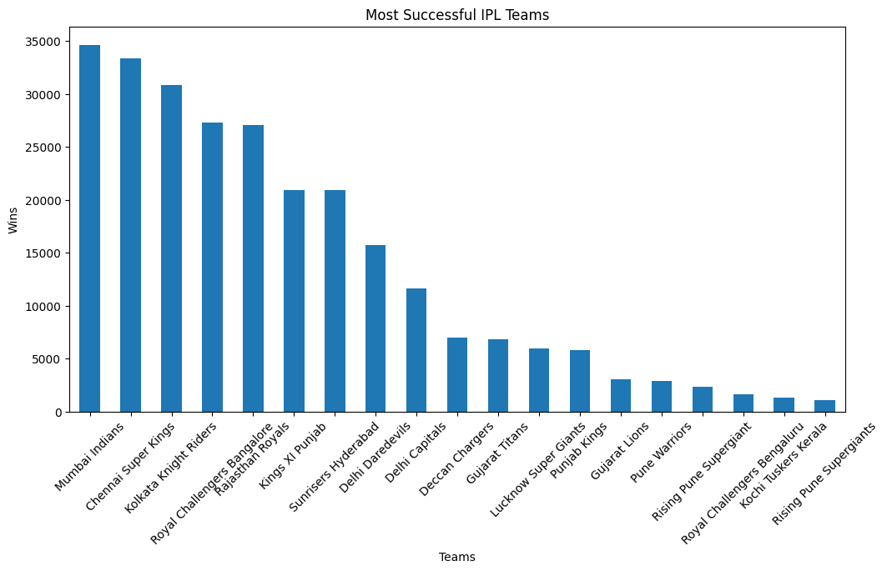
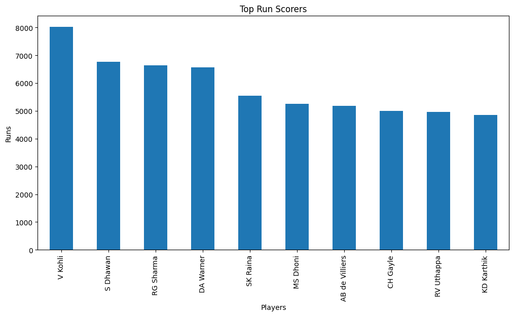
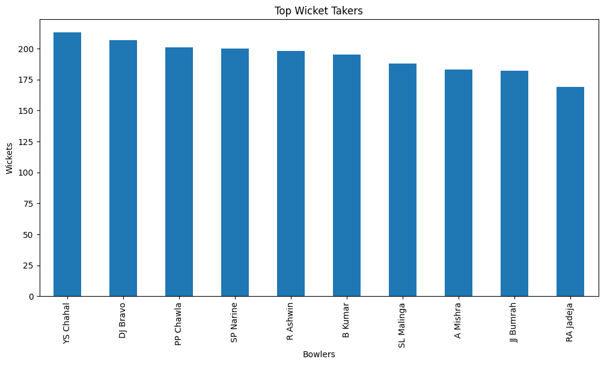
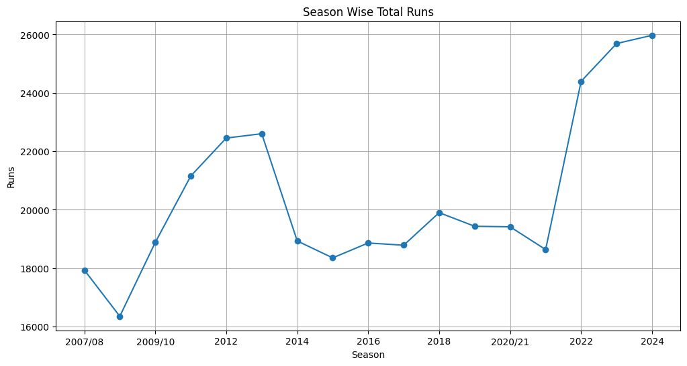
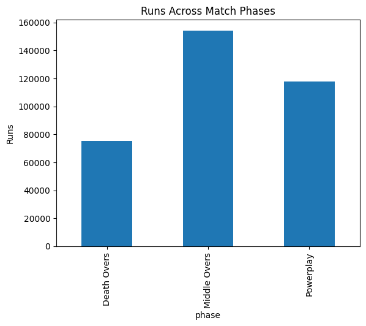
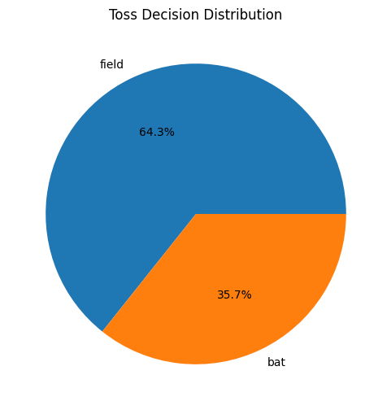
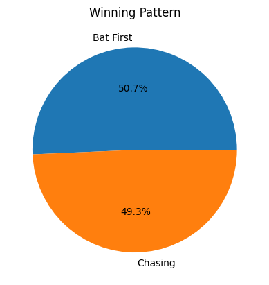
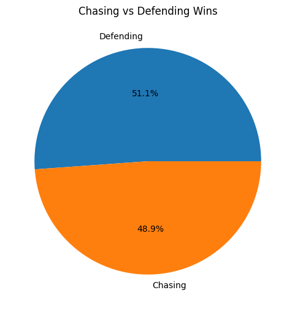
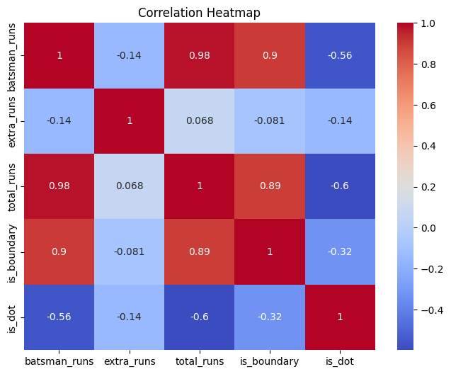
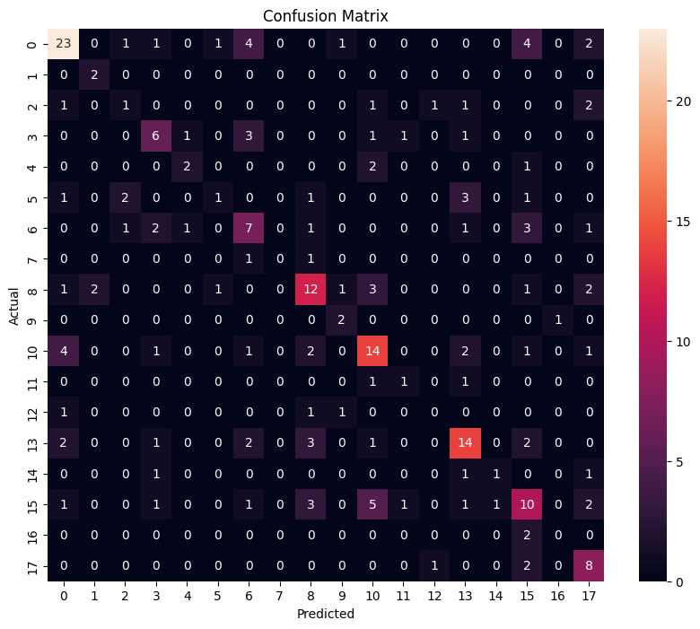

# IPL-Cricket-Analytics
Advanced IPL Cricket Analytics Project using Python, Machine Learning, Data Visualization, and Statistical Analysis to uncover match-winning insights from ball-by-ball IPL data.
# IPL Cricket Analytics Project

## Project Overview

This project performs advanced analytics on historical IPL (Indian Premier League) data using Python, Machine Learning, Statistical Analysis, and Data Visualization techniques.

The objective is to uncover match-winning insights, player performance trends, venue behavior, toss impact, batting patterns, bowling efficiency, and predictive analytics using ball-by-ball IPL datasets.

---

## Technologies Used

- Python
- Pandas
- NumPy
- Matplotlib
- Seaborn
- Scikit-Learn
- Machine Learning
- Exploratory Data Analysis (EDA)

---

## Dataset Information

The project uses:

- matches.csv
- deliveries.csv

These datasets contain:

- Match-level IPL information
- Ball-by-ball delivery data
- Team statistics
- Venue information
- Toss decisions
- Player performances

---

## Project Workflow

### Data Collection
- Imported IPL datasets
- Loaded match-level and ball-by-ball data

### Data Cleaning
- Handled missing values
- Standardized team names
- Removed inconsistencies

### Feature Engineering

Created advanced cricket KPIs:

- Total Runs
- Boundary Percentage
- Dot Ball Percentage
- Strike Rate
- Economy Rate
- Match Phase Analysis

### Exploratory Data Analysis

Performed:

- Team Performance Analysis
- Batting Analysis
- Bowling Analysis
- Toss Impact Analysis
- Venue Analysis
- Chasing vs Defending Analysis
- Player Consistency Analysis

### Machine Learning

Built a Random Forest Classifier to predict IPL match winners using:

- Team Names
- Toss Winner
- Toss Decision
- Venue Information

---

## Key Insights

- Teams chasing targets tend to win more matches.
- Death overs contribute the highest scoring rate.
- Toss decisions significantly influence outcomes.
- Certain venues favor batting-heavy teams.
- Dot-ball percentage strongly impacts bowling effectiveness.
- Team consistency is a major factor in tournament success.

---

## Machine Learning Model

### Model Used

Random Forest Classifier

### Workflow

- Data Preprocessing
- Label Encoding
- Train-Test Split
- Model Training
- Prediction
- Accuracy Evaluation
- Feature Importance Analysis

---

## Project Screenshots

### Most Successful IPL Teams



### Top Run Scorers



### Top Wicket Takers



### Season Wise Total Runs



### Runs Across Match Phases



### Toss Decision Distribution



### Winning Pattern Analysis



### Chasing vs Defending Wins



### Correlation Heatmap



### Confusion Matrix



---

## Project Structure

```bash
IPL-Cricket-Analytics/
│
├── dataset/
│   ├── matches.csv
│   └── deliveries.csv
│
├── notebook/
│   └── ipl_analysis.ipynb
│
├── Screenshots/
│   ├── team_wins.png
│   ├── top_run_scorers.png
│   ├── top_wicket_takers.png
│   ├── season_wise_runs.png
│   ├── match_phases.png
│   ├── toss_decision.png
│   ├── winning_pattern.png
│   ├── chasing_vs_defending.png
│   ├── heatmap.png
│   └── confusion_matrix.png
│
├── README.md
└── requirements.txt
```

---

## Installation

```bash
git clone https://github.com/abhiii444/IPL-Cricket-Analytics.git
cd IPL-Cricket-Analytics
```

Install dependencies:

```bash
pip install -r requirements.txt
```

---

## Requirements

```text
pandas
numpy
matplotlib
seaborn
scikit-learn
```

---

## Future Improvements

- Power BI Dashboard
- Streamlit Deployment
- Live IPL API Integration
- Win Probability Prediction
- Deep Learning Models

---

## Conclusion

This project demonstrates an end-to-end Data Analytics and Machine Learning workflow using real-world IPL cricket datasets. It combines statistical analysis, feature engineering, visualization, and predictive modeling to generate actionable cricket insights.

---

## Author

**Abhishek Rawat**

Aspiring Data Analyst

### Skills

- Excel
- SQL
- Python
- Power BI
- Machine Learning
